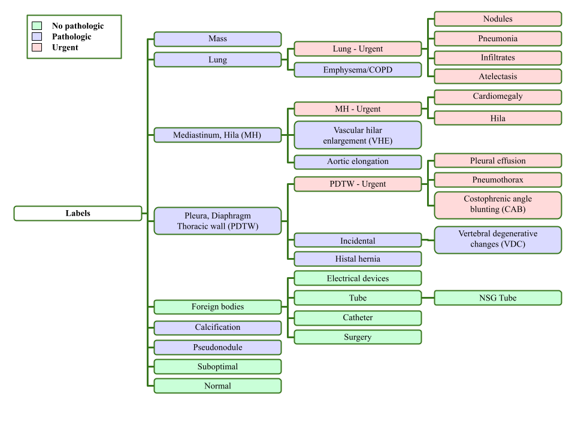

# RELIANCE

The RELIANCE project—*Radiología intELIgente en procesos AsisteNCiales urgEntes*—(Intelligent radiology in urgent care processes) aims to streamline the triage process in radiological emergency systems through the application of deep neural networks.

# About the project

This project focuses on the design and development of DNN for classifying chest X-rays into a 32-category pathology system specifically tailored for radiologists at the General University Hospital of Castellón, Spain. The system leverages deep learning models, including convolutional neural networks and vision transformers, intended for integration into medical device software to improve triage processes. A two-phase hyperparameter search found that the top-performing convolutional model achieved an AUC of 0.911, closely matching the 0.914 of the optimal vision transformer, highlighting the suitability of convolutional models for resource-constrained environments. The study also revealed inconsistencies in methodologies for effective augmentation and generalization, as training experiments showed minimal performance variation across different augmentation levels.

# Requirements

This repository is based on Python 3.11.10 and PyTorch 2.4. The full environment used in the project can be installed through the following steps:

1. `pip install -r requirements.txt`
2. `cd visionets/visionapi`
3. `pip install -e .`

The last step will install (in editable mode) the `visionapi` library specifically developed for this project. This library is responsible for model creation, data loading, optimizer setup, and includes several implemented loss functions.

# Structure of the project

We have developed different scripts:

- `train.py`: Main script used to fine-tune models with different hyperparameters in a distributed setup.
- `activelearn.py`: Script used to research the ability of different models to adapt to new samples from a different domain (not present in the paper).
- `search.py`: Script used to set up the hyperparameter search. Calls the main `train.py` script using `Popen`.
- `dbprocess`: Scripts to process the private Actualtec dataset, ChestX-ray14, and PadChest. Also contains scripts used to create training, validation and testing data.
- `inference`: Scripts used to perform inference on single DICOM images, folders of images, and data partitions created by `dbprocess` scripts. Also includes scripts to perform inference on the CheXpert dataset (not present in the paper).
- `utils`: Miscellaneous scripts for model exporting and metric computation.